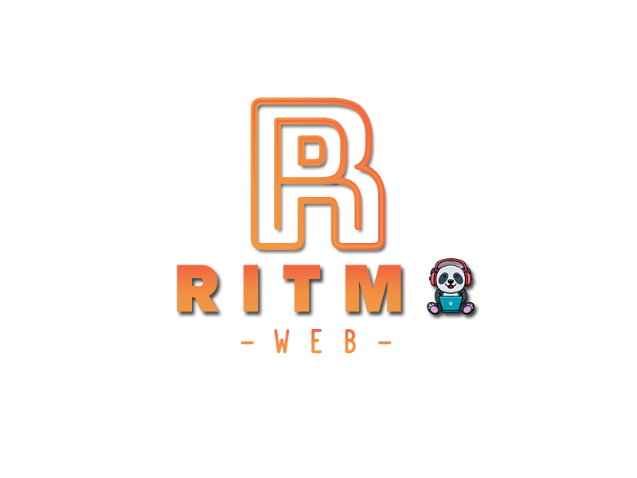

# Ritmo web

En este proyecto se trabajó en grupo y nos dividimos las tareas necesarias para diseñar un sitio que permita administrar canciones. El alcance de este proyecto se centró en cómo realizar todos los pasos del CRUD y mostrará los datos en forma de un catálogo de música. Por otro lado, se cumplieron otros requisitos solicitados.

### Link del Proyecto: [Ritmo web](https://ritmoweb.netlify.app/)



## Participantes de proyecto 😄

- Cristian Julian Aballay ✅
- Sheyla Astorga ✅
- Thiago Benjamín Fiol ✅
- Natalia del Valle Morales ✅
- Juan Diego Quintana ✅
- Verónica Daniela Soria ✅

## Librerias 📖

- [Boostrap v5.3.2](https://getbootstrap.com/)
- [SweetAlert v2](https://sweetalert2.github.io/)

## Pasos para clonar el proyecto

1- abre la terminal en el lugar que quieras, copia y pegas el siguiente codigo

```git clone https://github.com/juanchyquintana/proyectoModuloDos.git ```

y luego tendras tu carpeta